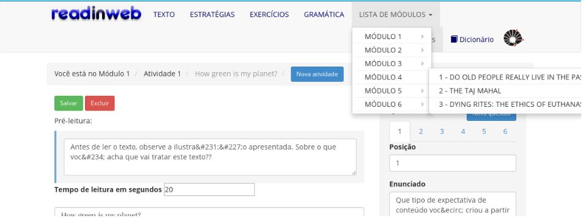

# Como adicionar palavras no Glossário e nas Palavras-Função?

Dentro de cada atividade do curso, você pode inserir palavras na área de Glossário. Para adicionar:

1. Clique no botão **Meu Site**.

2. Clique no menu **Read in Web Admin**, localizado ao lado esquerdo da tela.

3. Nesta página, estão os cursos já criados dentro da plataforma. Para editá-lo, clique em **Editar conteúdo**.

4. Escolha a atividade em que deseja adicionar uma palavra no glossário clicando em **LISTA DE MÓDULOS** e selecionando a atividade desejada.

5. Clique na aba **Dicionário**. 

6. Na aba glossário ou palavras-função, preencha os campos com a palavra e seu significado.

7. Para excluir ou editar uma palavra, siga os passos:
    * Na aba glossário ou palavras-função, clique no ícone de configuração localizado após a palavra que você deseja excluir. 

		
    * Para excluir a palavra, clique no ícone com um "x".

		

9. Quando finalizar, clique na palavra **Salvar**.
