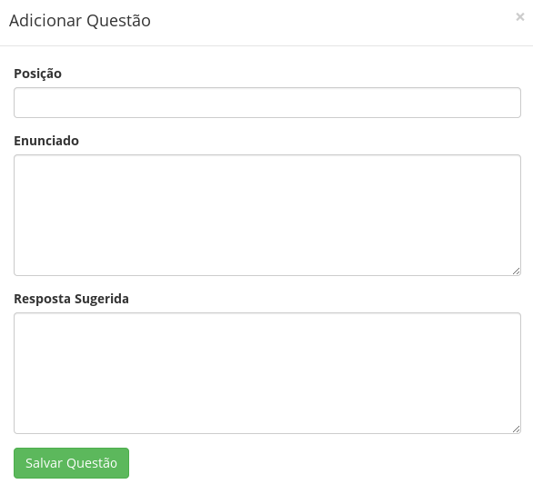

# Como adicionar uma questão?

Dentro de cada atividade do curso, você pode inserir questões referentes ao entendimento da leitura. Para adicionar:

1. Clique no botão **Meu Site**.

2. Clique no menu **Read in Web Admin**, localizado ao lado esquerdo da tela.

3. Nesta página, estão os cursos já criados dentro da plataforma. Para editá-lo, clique em **Editar conteúdo**.

4. Escolha a atividade em que deseja adicionar uma questão clicando em **LISTA DE MÓDULOS** e selecionando a atividade desejada.

5. Clique no botão **Nova questão**.

6. Na janela que abrir, preencha os campos com seus respectivos conteúdos:
  * **Posição**: será a posição em que a questão será mostrada no menu horizontal. É importante aqui verificar qual a posição da última questão para que seja inserida a próxima.
  * **Enunciado**: texto de enunciado da questão. 
  * **Resposta sugerida**: texto de resposta sugerida a ser exibido para o aluno como ponto de comparação com sua resposta.
  
