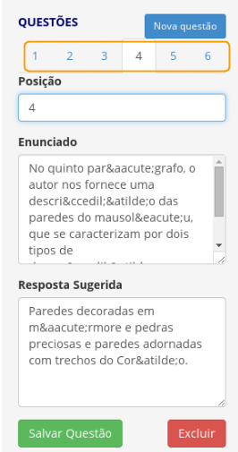

# Como excluir uma questão?

Para excluir uma questão:

1. Clique no botão **Meu Site**.

2. Clique no menu **Read in Web Admin**, localizado ao lado esquerdo da tela.

3. Nesta página, estão os cursos já criados dentro da plataforma. Para editá-lo, clique em **Editar conteúdo**.

4. Escolha a atividade em que deseja excluir uma questão clicando em **LISTA DE MÓDULOS** e selecionando a atividade desejada.

5. Escolha a questão que deseja excluir através do menu numérico de questões e clique em **Excluir**.

