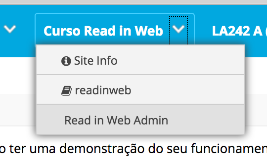

# Como criar uma turma dentro de um curso?

Para abrir uma nova turma do curso Read in Web é necessário estar logado no
sistema com o papel de Administrador.

Acesse a tela de administração do Read in Web pelo menu lateral ou superior:

1 - Clique no botão de "Nova turma" no curso que deseja.

2 - Na tela de criação, adicione os dados da no turma.

3 - No menu Sites do Sakai, busque o site referente a nova turma que foi criada
e clique no link de identificação do site para alterar suas propriedades.

4 - Para abrir matrículas, deixe as opções "Publicado" e "Pode se inscrever"
selecionadas. Após isso clique em Salvar.

5 - Ainda na tela do site, copie a identificação do site que possui o formato
`361f5b9ea54e148885dcad73ad3ea8f9`.

6 - Com a identificação copiada, clique em "Domínios" no menu lateral esquerdo e busque pelo site
colando a identificação no campo de Pesquisa. Os papéis de usuário da plataforma serão mostrados.

7 - Clique no papel **Student** e o checklist a seguir será mostrado.

8 - Para finalizar, selecione o campo `readinweb.access` e clique em Salvar.

