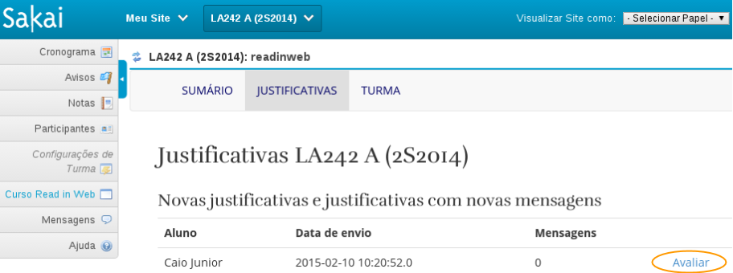

# Como ler e analisar cada justificativa?

Para ler e analisar as novas justificativas enviadas pelos alunos:

1. Selecione a turma em que você deseja verificar clicando no código da turma na barra superior azul.

2. Clique no menu **Curso Read in Web**, localizado ao lado esquerdo da tela.

3. Clique no botão **JUSTIFICATIVA** localizado na barra superior.

4. No campo **Novas justificativas e justificativas com novas mensagens**, estarão as justificativas a serem avaliadas. Clique no botão **Avaliar** para acessar cada justificativa.

5. Na tela da justificativa, o professor pode tomar as seguintes ações:
  * **Recusar**: ao clicar neste botão, a justificativa não será aceita e o aluno continuará bloqueado.
  * **Aceitar**: ao clicar neste botão, a justificativa será aceita e o aluno poderá acessar o curso novamente.
  * **Enviar uma mensagem**: aqui será enviada uma mensagem para o aluno (ele verá na tela dele de justificativas). Este recurso pode ser utilizado por exemplo para pedir mais informações ao aluno sobre a não realização das atividades.
  * Por fim, o professor pode apenas ler as mensagens e clicar em qualquer outro menu para sair desta tela. Ou seja, em outro momento ele analisará aquele bloqueio.

**Tela do professor**:

**Tela do aluno**:

