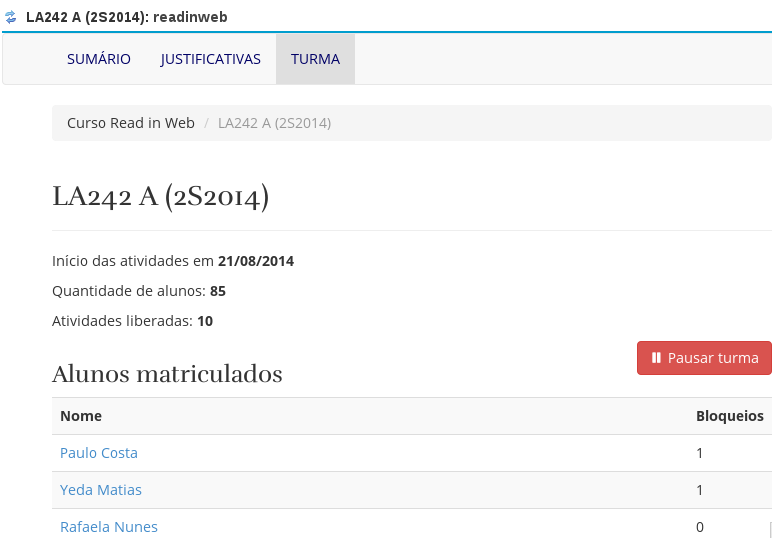
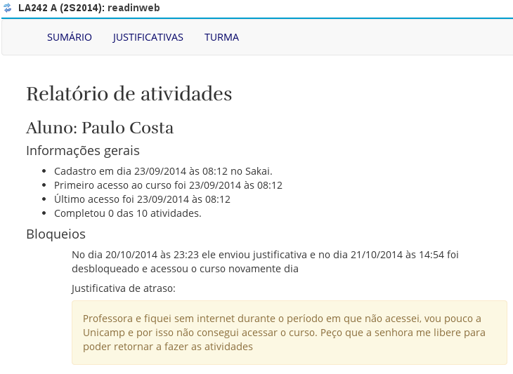

# Como verificar o histórico de bloqueios e justificativas de cada aluno?

Para verificar o histórico de bloqueios e justificativas de cada aluno em uma turma:

1. Selecione a turma em que você deseja verificar isso clicando no código da turma na barra superior azul.

2. Clique no menu **Curso Read in Web**, localizado ao lado esquerdo da tela.

3. Clique no botão **TURMA** localizado na barra superior.

4. No campo **Alunos matriculados**, estarão todos os alunos da turma. Para acessar cada aluno, basta clicar sobre seu nome.

5. Após clicar sobre o nome do aluno, você encontrará todo o histórico de bloqueios e justificativas do aluno. 