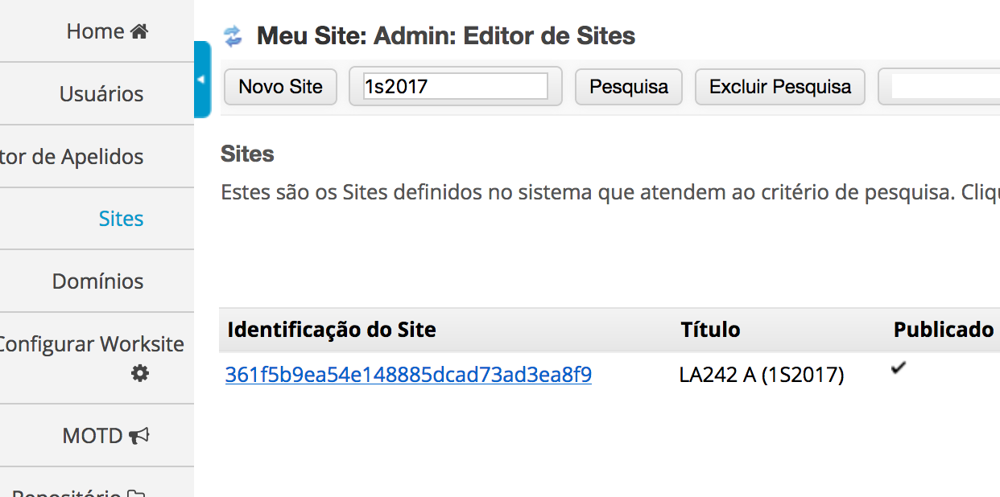
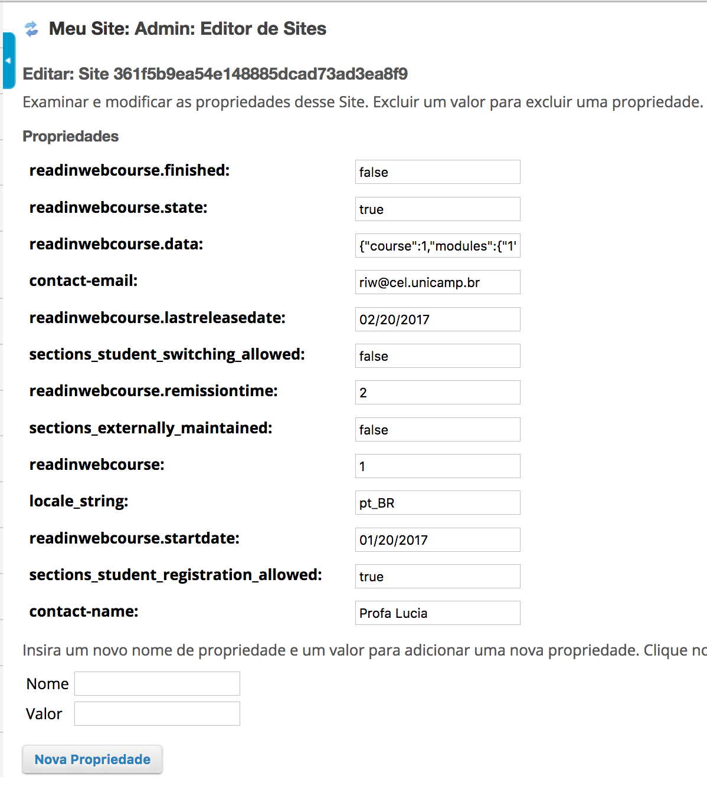

# Sobre a Liberação automática de atividades

No caso de optar por liberação automática de atividades pelo sistema, é necessário
acrescentar a propriedade `readinwebcourse.lastreleasedate` nas configurações do curso. 
Essa propriedade é o que mostra ao Sakai a data em que as últimas atividades forem liberadas.

Para acessar as propriedades de uma turma, dirija-se à página de **Sites** e em
seguida busque pelo site referente à turma desejada (a pesquisa deve ser feita através do nome da turma).


Após isso, clique no botão **Propriedades** para poder alterar e acrescentar
propriedades a uma turma. Veja abaixo um exemplo de quais propriedades o site da turma deve ter:


**Importante!**
- A propriedade `sections_externally_maintained` precisa estar definida como `false` para que as atividades sejam liberadas automaticamente. 
- A propriedade `readinwebcourse.remissiontime` refere-se à periodicidade em que as atividades serão liberadas em uma escala semanal.

# Como liberar atividades manualmente

Na tela de Propriedades da turma, é possível liberar e esconder atividades
manualmente alterando o campo `readinwebcourse.data`, que possui o seguinte
formato divido por módulos e atividades:

```
{"course":1,
"modules":{
    "1":{
        "status":true,
        "activities":{
            "1":{
                "status":true
            },
            "2":{
                "status":true
            },
            "3":{
                "status":true
            },
            "4":{
                "status":true
            },
            "5":{
                "status":true
            }
        }
    },
    "2":{
        "status":false,
        "activities":{
            "6":{
                "status":false
            },
            "7":{
                "status":false
            },
            "8":{
                "status":false
            },
            "9":{
                "status":false
            },
            "10":{
                "status":false
            }
        }
    },
    "3":{
        "status":false,
        "activities":{
            "11":{
                "status":false
            },
            "12":{
                "status":false
            },
            "13":{
                "status":false
            },
            "14":{
                "status":false
            },
            "15":{
                "status":false
            }
        }
    },
    "4":{
        "status":false,
        "activities":{
            "16":{
                "status":false
            },
            "17":{
                "status":false
            },
            "18":{
                "status":false
            }
        }
    },
    "5":{
        "status":false,
        "activities":{
            "19":{
                "status":false
            },
            "20":{
                "status":false
            },
            "21":{
                "status":false
            },
            "22":{
                "status":false
            }
        }
    },
    "6":{
        "status":false,
        "activities":{
            "23":{
                "status":false
            },
            "24":{
                "status":false
            },
            "25":{
                "status":false
            }
        }
    }
}

}
```
**Observação**

As atividades que recebem o valor `true` estão liberadas aos estudantes,
enquanto as que recebem o valor `false` não são exibidas.
