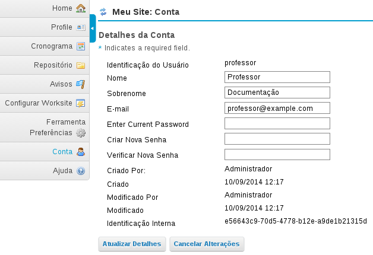

# Como alterar seu nome, email e senha?

Para alterar seu e-mail de cadastro na plataforma:

1. Clique no botão **Meu Site**.

2. Clique no menu **Conta**, localizado ao lado esquerdo da tela.

3. Clique no botão **Modificar Detalhes**. A tela que será aberta possui todos os campos editáveis para modificar as informações.

4. Para alterar **o nome, sobrenome e email**, basta substituir os conteúdos destes três campos.

5. Para alterar a **senha** é preciso inserir a senha atual (*Enter Current Password*) e inserir a nova senha nos dois últimos campos.

6. Quando finalizadas as alterações, clique em **Atualizar Detalhes**.

  