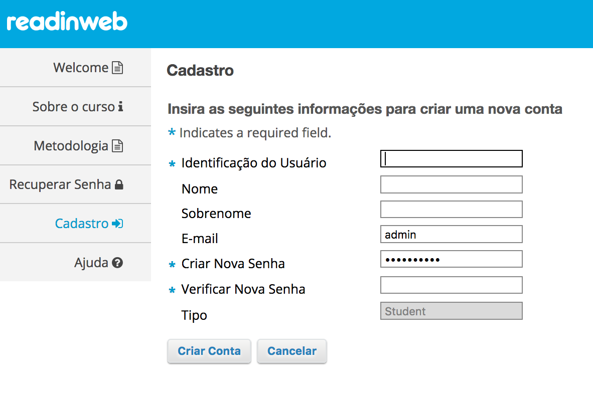
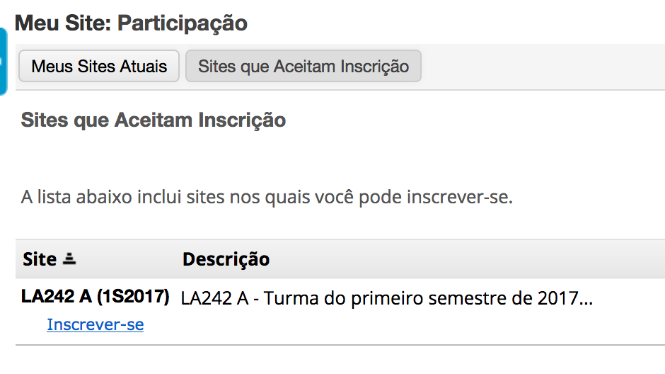

# Como se matricular em uma turma

Para se matricular em uma turma que esteja aberta para matrículas, é necessário
se cadastrar na plataforma através do link "Cadastro" e preencher o formulário
que será exibido:

Após o cadastro, a página será redirecionada para a página principal de usuário.
No menu lateral, clique no link **Inscrições**:

Na tela de inscrições, é possível verificar as turmas em que você já se inscreveu
assim como inscrever-se nas turmas que estão abertas. Para inscrever-se em uma
nova turma, clique em **Sites que aceitam inscrição**:

Clique no link "Inscrever-se", na turma que deseja inscrever-se. Após isso,
basta recarregar a página que a turma em questão irá aparecer no seu menu
principal.
