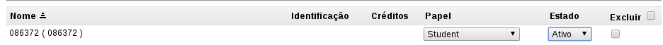

# Como desativar o aluno, cancelando sua matrícula do curso?

É possível desativar um aluno de uma turma e também exclui-lo de lá, sendo que em ambos os casos o aluno perderá o acesso à turma. A diferença entre eles é:

* Quando você torna um aluno inativo, você pode reativá-lo, quando quiser, dentro da mesma turma.
* Quando você excluir um aluno da turma, caso deseje inseri-lo novamente, é preciso adicioná-lo na turma manualmente.
 
De qualquer forma, para efetuar qualquer uma dessas ações, o caminho é o mesmo:

1. Selecione a turma em que você deseja desativar ou excluir um aluno clicando no código da turma na barra superior azul.

2. Clique no menu **Configurações de Turma**, localizado ao lado esquerdo da tela.

3. Vá até a lista de alunos abaixo na tela e:
    * Altere o estado do aluno para inativo, caso essa for sua escolha.
    * Marque o campo excluir, caso essa seja sua escolha.

4. Para finalizar, clique no botão **Atualizar Participantes** localizado no fim da página.
